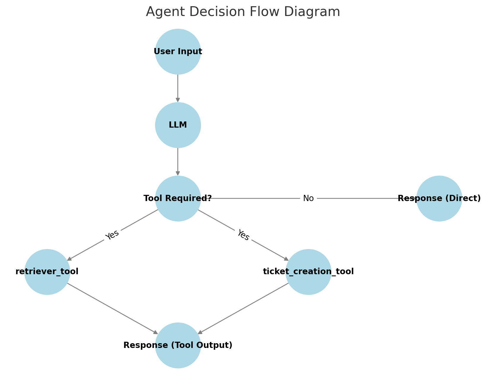

# Michigan Imaginary Energy Assistant

## Prerequisites

This application requires an OpenAI API key to function properly. Ensure you have a valid API key before using the app.

## Features

The Michigan Imaginary Energy Assistant provides a robust set of features designed to enhance data retrieval and ticket management. Key features include:

### 1. Hybrid Retrieval System

- Retrieves information from a **vector database** for efficient semantic search.
- Retrieves information from an **SQLite database** for structured query-based retrieval.
- Combines both sources to create a **hybrid retrieval system**, ensuring accurate and comprehensive responses.

### 2. Ticketing System

- Users can **create new tickets** for support or assistance.
- Users can **retrieve the status of existing tickets**, ensuring smooth issue tracking and resolution.

## Usage

1. **Set up the environment:**
   - Create a Python environment using Conda:
     ```sh
     conda create --name <env_name> python=3.10.13
     conda activate <env_name>
     ```
   - Install dependencies:
     ```sh
     pip install -r requirements.txt
     ```

2. **Seed the database (optional):**
   - If you need to re-seed the database, navigate to the `create_data` directory and run:
     ```sh
     python createdb.py
     python loaddocs.py
     ```

3. **Run the application:**
   - Start the app using Streamlit:
     ```sh
     streamlit run app.py
     ```
   - The application will be available at `http://localhost:8501`

## Project Structure

```
.
├── app.py
├── chroma_db
│   ├── ade9063b-75b9-45b4-9c88-c12d579e1a7e
│   │   ├── data_level0.bin
│   │   ├── header.bin
│   │   ├── length.bin
│   │   └── link_lists.bin
│   └── chroma.sqlite3
├── create_data
│   ├── createdb.py
│   ├── documents
│   │   ├── Energy_Efficiency_Tips.txt
│   │   ├── Green_energy_plan_FAQ.txt
│   │   └── Solar_Panel_Installation_Guide.pdf
│   └── loaddocs.py
├── energy_products.db
├── README.md
├── requirements.txt
└── testing
    └── main.py
```

5 directories, 15 files

## Additional Details

### API Key Configuration
- The application requires an OpenAI API key for execution.
- The API key can be entered in the sidebar input field.

### Database Interaction
- Uses **SQLite** as the primary database.
- Supports querying multiple tables using the **SQL agent**.

### Vector Search
- Utilizes **ChromaDB** for semantic search.
- Embedding model used: **sentence-transformers/all-MiniLM-L6-v2**.

### Agent Architecture
- The implementation uses the **ReAct agent** from the LangChain framework.
- The agent dynamically decides when to use each tool based on the tool descriptions provided during definition.
- This approach allows the agent to efficiently retrieve information and generate responses based on the query context.
- The agent leverages a **hybrid retrieval system**, combining SQL queries for structured data and ChromaDB for unstructured data.
- The **LangChain SQL agent** executes queries against the database, while the **vector retriever** fetches semantically relevant documents.
- The system prioritizes structured data first and enhances it with unstructured document insights.

### Retrieval Tool Details
- The **retriever tool** is responsible for extracting relevant information from both structured and unstructured data sources.
- For structured data, the `multi_table(query)` function leverages the **LangChain SQL agent** to execute SQL queries across multiple tables in SQLite.
- For unstructured data, `retriever.get_relevant_documents(query)` fetches semantically similar documents using **ChromaDB**.
- The results from both retrieval methods are combined to generate a holistic response to user queries.
- This dual approach ensures that responses are both factually accurate from structured data and contextually rich from unstructured knowledge sources.

### Agent Decision Flow


- The diagram represents how user input is processed by the LLM.
- If the input requires a tool, the agent chooses between the `retriever_tool` and `ticket_creation_tool`.
- If no tool is needed, the response is generated directly.

### Interacting with the Q&A System
- Users can submit natural language queries through the Streamlit UI.
- The system automatically determines whether to query the SQL database or retrieve vector-based knowledge.
- Example queries:
    - "I need assistance with solar panel installation"
    - "Retrieve all current tickets and all information" 
    - "What are our current energy offers?"
    - "What is the difference between the Green Energy Plan and Fixed-Rate Plan?"

### Ticket Creation Workflow
- Users can submit a request for support via the interface.
- The system logs the request in the `energy_products.db` database under the `tickets` table.
- Example:
  - User inputs: *“I need assistance with solar panel installation.”*
  - The system responds: *“Ticket #5678 created successfully.”*
- The ticket can be retrieved later using its ID.

### Available Tools
- `retriever_tool`: Retrieves information from structured and unstructured sources.
- `ticket_creation_tool`: Allows users to create support tickets.

### Query Execution
- Queries can retrieve information from both SQL and vector databases.
- Support tickets are stored in `energy_products.db`


## Deliverables
The project source code is available in a GitHub repository or a zipped folder containing:
- **Source code** with implementation scripts.
- **Database setup scripts** for initializing and seeding the SQLite database.
- **Example documents** in the file system for vector search indexing.
- **Instructions** on environment setup, dependencies, and execution steps.
- **Documentation (README)** detailing:
  - How the RAG pipeline is built and operates.
  - Interaction steps for the Q&A system.
  - Ticket creation and tracking workflows.

For any additional troubleshooting or modifications, refer to the documentation or reach out to the development team.


